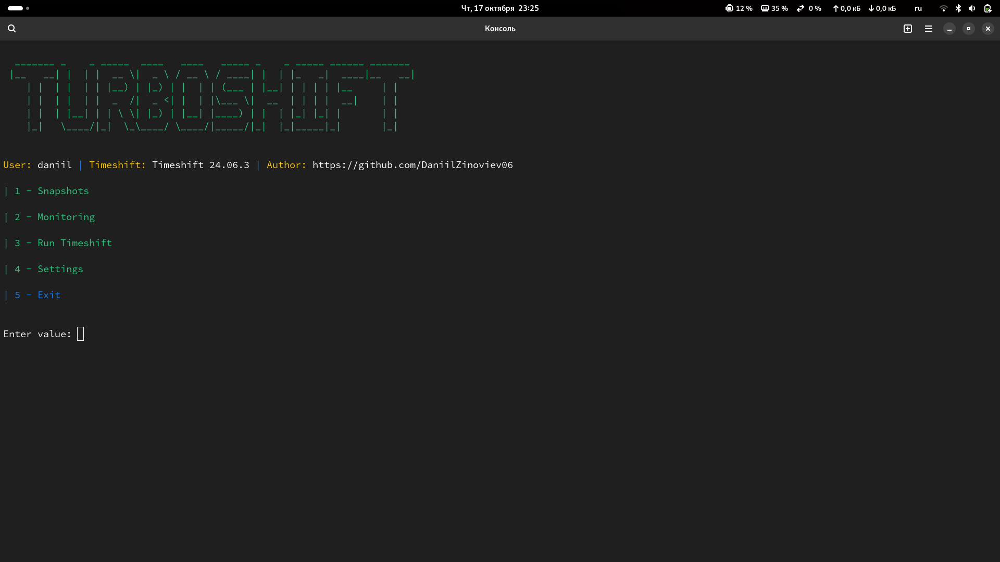
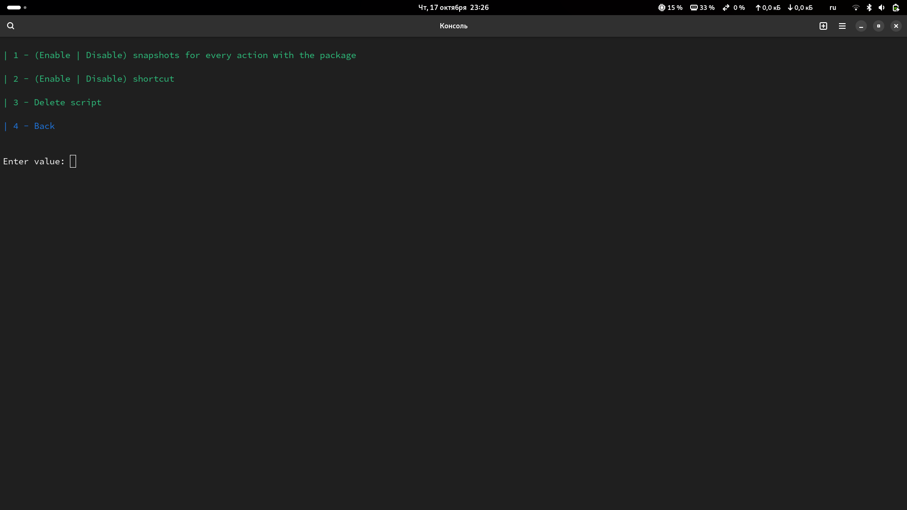
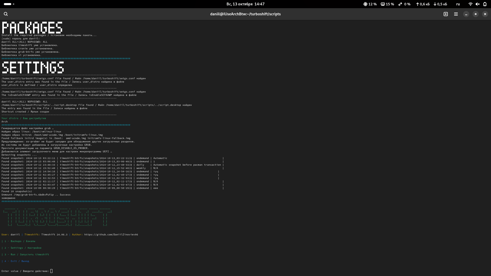
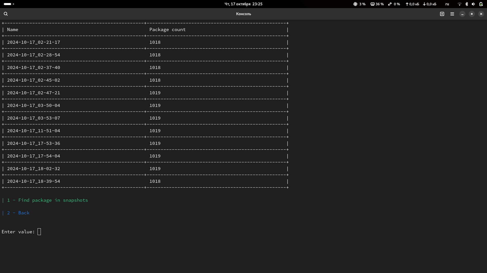
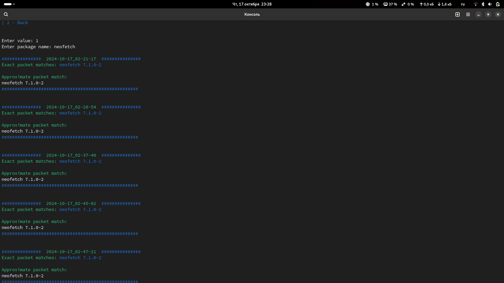

<div align="center" class="screenshots" markdown="1" style>



  


</div>

# :tornado: TURBOSHIFT
Turboshift is a handy Timeshift-based script that automates the creation of snapshots and updating the GRUB bootloader before installing any package on your system. It is a tool designed to improve the security and reliability of your workflow by providing the ability to quickly restore your system if problems arise after installing the software.

## :rocket: Features
* Automatic creation of snapshots before any action with the package
* Automatic creation of snapshots
* Updating the GRUB bootloader
* Automatic setting
* Searching packages in Snapshots

## :warning: Recommendation
`Please delete the script through the script settings`
> This is necessary so that later there are no problems with the timeshift shortcut

## :computer: Installation
First copy the repository:
```bash
git clone https://github.com/DaniilZinoviev06/turboshift.git
cd turboshift
```
Next, run the `script.sh` to install the necessary dependencies and initial configuration
```bash
chmod +x script.desktop
cd scripts
chmod +x script.sh
./script.sh
```

<div align="center" class="screenshot" markdown="1" style>


</div>

## :coffin: Uninstall

<details>
<summary>:toolbox: Using settings</summary> 
   
   </br>
   
   > To delete you can use the option in the settings </br>
</details>

`or`
<details>
<summary>:superhero: independently</summary>
   
   </br>
   
   Go to the directory with the project. Next: </br>
   ```bash
   sudo mv timeshift-gtk.desktop /usr/share/applications/
   sudo mv /usr/share/applications/script.desktop /your/path/to/turboshift
   sudo rm -rf /your/path/to/turboshift
   ```
</details>

## 🖥️: Screenshots

<div align="center" class="screenshots" markdown="1" style>








  


   
</div>


